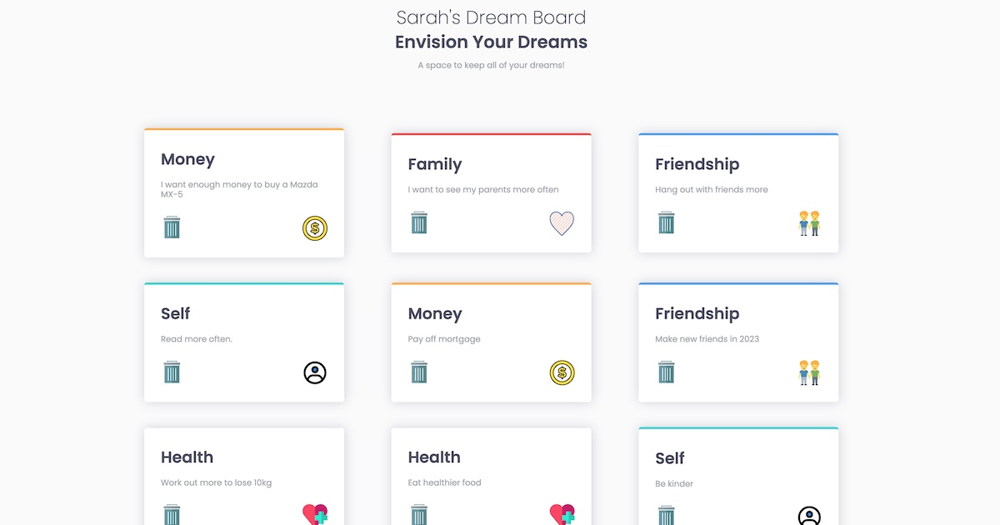

# Club Members
A fullstack project utilizing Express, Node.js, Mongoose/MongoDB, Passport.
It allows users to create accounts and add their motivational dreams to their board in the form of cards.
Sessions are stored allowing users to stay logged in for a period of time when closing tabs. 

**Link to project:** https://dreamboard.cyclic.app/

## How It's Made:

**Tech used:** Node.js, Express, Passport, MongoDB, Mongoose, EJS, Javascript, HTML, CSS 

## Optimizations

Adding images to the cards would be a nice feature.

## Lessons Learned:

I learnt that guiding users through an experience the first time is important as my test users missed important details!

## Examples:
Take a look at these other examples that I have in my portfolio:

**React Grocery List:** https://github.com/FlutterSoft/react-grocery-list

**Hackerz:** https://github.com/FlutterSoft/hackerz

**Frontend Mentor Projects:** https://github.com/FlutterSoft/FrontEndMentor

